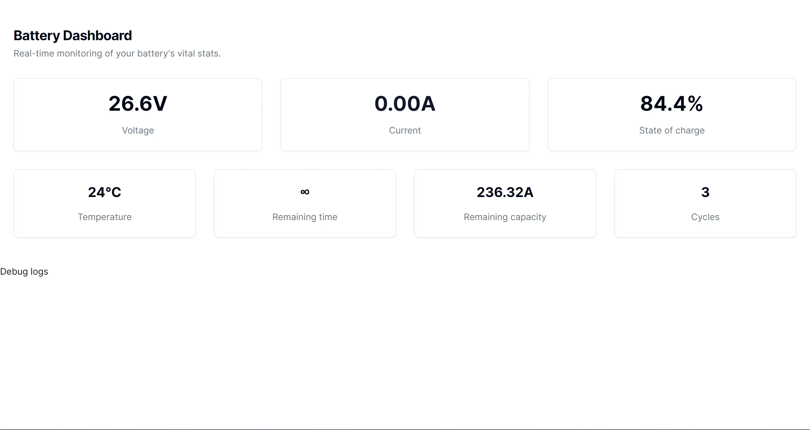

# Daly BMS Dashboard

A static HTML page which uses Web Bluetooth API to connect to Daly BMS and to display BMS state in a dashboard.

Open https://daly-web-dashboard-bluetooth.pages.dev/ , click "Connect" and select Daly BMS device (if not present, click a button on Daly Bluetooth dongle).

## Screenshot

